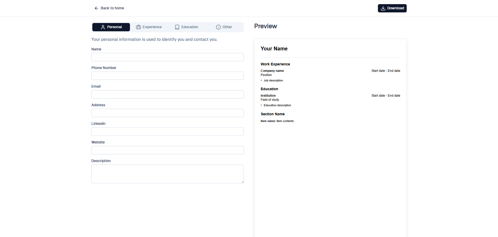

# Resumzy - Modern Resume Builder

Resumzy is a modern web application built with Nuxt 3 that allows users to easily create, customize, and export professional resumes. The intuitive interface guides users through adding personal information, education, work experience, and more to generate polished resume documents.



## Features

- **User-friendly Form Interface**: Easily input your personal information, education history, work experience, and other details
- **Real-time Preview**: See your resume take shape as you enter your information
- **Export Options**: Export your resume as a PDF document
- **Responsive Design**: Works seamlessly on desktop and mobile devices
- **Modern UI**: Built with Nuxt UI for a clean, professional look

## Tech Stack

- [Nuxt 3](https://nuxt.com/): Vue.js framework
- [Nuxt UI](https://ui.nuxt.com/): UI component library
- [Vue 3](https://vuejs.org/): JavaScript framework
- [jsPDF](https://parall.ax/products/jspdf): PDF generation library

## Setup

Make sure to install dependencies:

```bash
# npm
npm install

# pnpm
pnpm install

# yarn
yarn install

# bun
bun install
```

## Development Server

Start the development server on `http://localhost:3000`:

```bash
# npm
npm run dev

# pnpm
pnpm dev

# yarn
yarn dev

# bun
bun run dev
```

## Production

Build the application for production:

```bash
# npm
npm run build

# pnpm
pnpm build

# yarn
yarn build

# bun
bun run build
```

Locally preview production build:

```bash
# npm
npm run preview

# pnpm
pnpm preview

# yarn
yarn preview

# bun
bun run preview
```

## Project Structure

- `components/`: Vue components for different resume sections
  - `PersonalInformation.vue`: Form for personal details
  - `Education.vue`: Form for education history
  - `Experience.vue`: Form for work experience
  - And more...
- `pages/`: Application routes
  - `index.vue`: Landing page
  - `resume/create.vue`: Resume creation page
- `utils/`: Utility functions
- `assets/`: Static assets and styles

## License

MIT

## Contributing

Contributions are welcome! Please feel free to submit a Pull Request.
